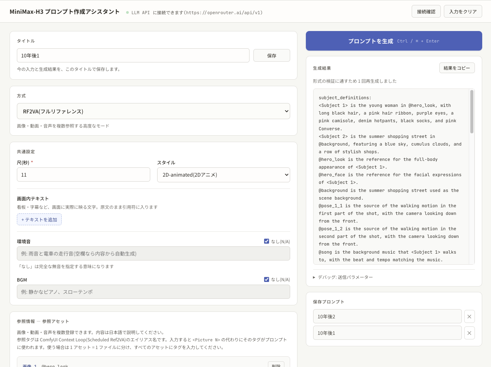

# MiniMax-PromptAssistant

動画生成 AI「MiniMax-H3」用の英語プロンプトを、**日本語の入力から生成する Web アプリケーション**です。

公式プロンプトガイドの要点とユーザー入力を LLM へ送り、ガイド準拠の構造化プロンプトを組み立てます。
LLM は **OpenRouter などの外部サービス**でも、**llama.cpp などのローカル LLM** でも使えます。



## 特徴

- 必要な項目を日本語で記述すると、MiniMax-H3 用に構造化されたプロンプトを出力
- 全 5 方式に対応（T2VA / I2VA / FL2VA / L2VA / RF2VA）
- **OpenRouter など外部サービスに対応**。GPU がなくても利用できる
- ローカル LLM（llama.cpp）にも対応。入力内容を外部に送らずに使える
- ページを再読み込みしてもパラメーターは復元される

### 対応方式

| 方式 | 説明 | 参照するもの |
|---|---|---|
| T2VA | テキストのみから生成 | なし |
| I2VA | 最初のフレームを指定 | Picture 1(最初) |
| FL2VA | 最初と最後のフレームを指定 | Picture 1(最初)+ Picture 2(最後) |
| L2VA | 最後のフレームを指定 | Picture 1(最後) |
| RF2VA | フルリファレンスモード | 参照アセット(画像/動画/音声)を複数 |

※画像からのプロンプト生成は行いません。画像の内容はユーザー自身が文章で入力する仕組みです。

## 動作環境

| 必要なもの | 条件 | 備考 |
|---|---|---|
| Python | 3.10 以上 | バックエンド |
| uv | 最新版 | 仮想環境と依存を自動で用意する。pip でも代用可 |
| LLM API | OpenAI 互換 | llama.cpp または OpenRouter など外部サービス |
| GPU | llama.cpp を使う場合は VRAM 12GB 以上を推奨 | 外部サービスを使う場合は不要。CPU のみでも動くが非常に遅い |

## セットアップ

### 1. アプリを入手する

[Releases](https://github.com/da2el-ai/MiniMax-PromptAssistant/releases) から zip をダウンロードして展開します。

展開したら PowerShell などターミナルを開き、展開したフォルダを開きます。

※ソースを改変したい場合は [docs/CONTRIBUTING.md](docs/CONTRIBUTING.md) を参照してください。

### 2. LLM API の準備

本アプリは OpenAI 互換の LLM API を呼び出します。<br>
まず `backend/.env.example` を
`backend/.env` にコピーしてください。

```bash
cp backend/.env.example backend/.env
```

```powershell
# Windows(PowerShell)
Copy-Item backend\.env.example backend\.env
```

コピーした `backend/.env` を、使う LLM に合わせて編集します。

#### ◆ OpenRouter など外部サービスを使う場合

GPU は不要です。API キーの取得手順は [docs/openrouter.md](docs/openrouter.md) を参照してください。

```dotenv
LLM_BASE_URL=https://openrouter.ai/api/v1
LLM_MODEL=使いたいモデル名
LLM_API_KEY=APIキー

入力例：
LLM_BASE_URL=https://openrouter.ai/api/v1
LLM_MODEL=cognitivecomputations/dolphin-mistral-24b-venice-edition
LLM_API_KEY=sk-or-v1-xxxxxxxxxxxxxxxxxxxxxxxxxxxxxxxxxxxxx
```

> 入力内容がそのサービスへ送信されます。また、生成 1 回ごとに料金が発生します。

#### ◆ llama.cpp(ローカル LLM)を使う場合

別途 `llama-server` を起動しておく必要があります。起動方法と起動オプションは[docs/llama-cpp.md](docs/llama-cpp.md) を参照してください。

```dotenv
LLM_BASE_URL=http://127.0.0.1:8080/v1
LLM_MODEL=local-model
LLM_API_KEY=
```

`.env.example` の既定値と同じなので、`llama-server` を `127.0.0.1:8080` で起動しているなら
書き換えは不要です。

#### ◆ そのほかの設定項目

<details>
<summary>環境変数の一覧を開く</summary>

`backend/.env`(または実際の環境変数)で設定します。設定例は
[backend/.env.example](backend/.env.example) にあります。

| 変数 | 既定値 | 説明 |
|---|---|---|
| `LLM_BASE_URL` | `http://127.0.0.1:8080/v1` | OpenAI 互換 API のベース URL。末尾は `/v1` |
| `LLM_MODEL` | `local-model` | モデル ID。llama-server は単一モデルのため任意の識別子でよい |
| `LLM_API_KEY` | (空) | API キー。llama-server では `--api-key` 付きで起動した場合のみ設定する |
| `LLM_TIMEOUT_SEC` | `300` | 1 回のリクエストのタイムアウト(秒) |
| `LLM_TEMPERATURE` | `0.7` | 生成の多様性。0.6〜0.8 が目安 |
| `LLM_TOP_P` | `0.9` | nucleus sampling の閾値 |
| `LLM_MAX_TOKENS` | `4096` | 生成の最大トークン数。出力が途中で切れる場合は増やす |
| `LLM_RESPONSE_FORMAT` | `json_schema` | 構造化出力の指定方法(`json_schema` / `json_object` / `none`) |
| `LLM_DISABLE_THINKING` | `true` | 思考モード(`reasoning_content`)を無効化する |
| `GENERATE_MAX_RETRIES` | `3` | 検証 NG 時の再生成回数の上限 |
| `CORS_ORIGINS` | `http://localhost:5173,http://127.0.0.1:5173` | CORS 許可オリジン(カンマ区切り)。**通常の起動では使われない**(開発用) |

> `.env` は**起動時に一度だけ**読み込みます。`.env` を変えたらバックエンドを再起動してください。

</details>

### 3. MiniMax-PromptAssistant を起動する

展開したフォルダで次を実行します。

#### ◆ uv を使う場合

```bash
uv run serve.py
```

初回は仮想環境の作成と依存の導入が自動で走るため、少し時間がかかります。

#### ◆ pip を使う場合

```bash
python3 -m venv .venv    # 初回のみ
.venv/bin/pip install .  # 初回のみ
.venv/bin/python serve.py
```

```powershell
# Windows(PowerShell)
python -m venv .venv          # 初回のみ
.venv\Scripts\pip install .   # 初回のみ
.venv\Scripts\python serve.py
```

#### ◆ 実行後

サーバーが起動し、ブラウザで <http://127.0.0.1:8000> が開きます。

起動ログに `LLM API 接続先: ...` と出れば、`.env` の設定が正しく読めています。画面ヘッダーの
接続状態が緑になっていれば準備完了です。

> `serve.py` は画面(フロントエンド)と API(バックエンド)を同じポートで動かします。以降の説明で「バックエンドを再起動する」とあるのは、この `serve.py` を `Ctrl + C` で止めて実行し直すことを指します。

#### ◆ `serve.py` 起動オプション

| オプション | 既定値 | 説明 |
|---|---|---|
| `--port` | `8000` | 待ち受けポート |
| `--host` | `127.0.0.1` | 待ち受けアドレス。LAN の他端末から使うなら `0.0.0.0` |
| `--no-browser` | — | 起動時にブラウザを開かない |

> `--host 0.0.0.0` を指定すると、同じネットワーク上の誰でも画面と API を開けるようになります。
> 信頼できるネットワークでのみ使用してください。

## 使い方

1. 左カラム上部の**方式**(T2VA / I2VA / FL2VA / L2VA / RF2VA)を選ぶ
2. **尺**(秒)と**スタイル**を指定する。スタイルは「自動」にすると内容から推定される
3. **ショット**に、場面の説明・カメラワーク・セリフを日本語で書く。「ショットを追加」で複数
   ショットに分割できる
4. 必要に応じて画面内テキスト・環境音・BGM を指定する
5. 「プロンプトを生成」を押すと、英語プロンプトが右カラムに表示される

補足:

- `Ctrl + Enter` / `⌘ + Enter` で生成できます
- `Alt + Enter` / `Option + Enter` で生成結果をコピーできます(「結果をコピー」と同じ)
- 入力内容は自動で localStorage に保存され、次回アクセス時に復元されます。初期状態に戻したい
  ときはヘッダーの「入力をクリア」を押してください
- ヘッダーに LLM API との疎通状態を表示します。確認は起動時の 1 回のみで、以降はヘッダーの
  「接続確認」を押したときに再確認します(従量課金の外部 API でも待機中に費用が発生しないため)
- カット時刻は、未入力のショットについて前後の確定値の間に均等配分されます
- 生成結果の下の「デバッグ: 送信パラメーター」を開くと、実際に送信した JSON を確認できます

### 使い方のコツ

**セリフが複数あるときは、動作の説明に混ぜて書く**

各ショットの「セリフ」に記載した後、「女性が手を振りながらセリフ 1 を笑顔で言う」のように書くと、
LLM がセリフを適切な位置に挿入してくれます。

**時間経過で動きをつけたいときは秒数を書く**

ショットを分けるほどでもない動きの変化は、`[Shot N]` を使わずに「3 秒目：○○をする」と
書いてください。MiniMax-H3 側がタイミングを判断してくれます。

**RF2VA で参照素材の使い方を限定する**

参照素材を文中で指定するときは「画像 1 はポーズのみ使い、背景は使わない」のように、
どの要素を使ってどの要素を使わないかまで書くと意図が伝わります。

## 動作の仕組み

書式が厳密に決まっている部分は LLM に任せず、Python 側で確定させています。

- **コードが決める**: 先頭の指示行、フィールド名、各ショットのカット時刻(`MM:SS.mmm`)、
  話者 ID(`S1`, `S2` …)、参照アセットのラベル(`<Picture N>` など)、環境音 / BGM の `N/A`
- **LLM が書く**: 英語の描写本文(`integrated_multimodal_description`)、`overall_soundscape`、
  `non_diegetic_music`、RF2VA の各セクション

生成結果は [backend/validator.py](backend/validator.py) で検証し、違反があればその内容を LLM に
伝えて再生成します(既定で最大 3 回)。主な検証項目は次のとおりです。

- `[Shot 1]` から `[Shot N]` が過不足なく順番に現れ、`[Shot 1]` にはタイムスタンプが付かない
- `[Shot 2]` 以降のカット時刻が、コード側で確定した値と完全一致する
- `<d>` タグが開閉対応し、内側の先頭に言語タグがある
- **ユーザーが入力したセリフが翻訳・改変されず、逐語で `<d>` 内に含まれる**
- 画面内テキストが原文のまま二重引用符で含まれる

再生成しても残った違反は、レスポンスの `warnings` に日本語で載せて画面に表示します。

## トラブルシューティング

### `LLM の応答に JSON が含まれていません` と出る

モデルの思考モード(`reasoning_content`)が有効だと、思考だけで `max_tokens` を使い切り、
本文(`content`)が空のまま返ってくることがあります。

1. llama.cpp を使っている場合、`llama-server` に `--jinja` が付いているか確認する
2. `LLM_MAX_TOKENS` を `8192` などに増やす
3. それでも起きる場合は `LLM_DISABLE_THINKING=false` を試す(モデルが
   `enable_thinking` に対応せずエラーになっているケース)

`content` が空でも `reasoning_content` に JSON があれば、そちらから回収を試みます。

### `LLM API に接続できません` と出る

- `LLM_BASE_URL` の末尾が `/v1` になっているか
- `.env` を変更したあと、バックエンドを**再起動**したか
- llama.cpp: `llama-server` が起動しているか(<http://127.0.0.1:8080> が開けるか)
- 外部サービス: `LLM_API_KEY` が正しいか、クレジット残高が残っているか

バックエンドの起動ログに出る `LLM API 接続先: ...` で、実際の接続先を確認できます。

### `.env` を変えたのに反映されない

`.env` は起動時に一度だけ読み込みます。`serve.py` を `Ctrl + C` で止めて実行し直してください。

### 生成に時間がかかる / 応答がない

`LLM_TIMEOUT_SEC` を増やすことで打ち切りを避けられます。llama.cpp を使っている場合は、
`-ngl` が足りず CPU 推論になっている可能性があります。起動ログで
`offloaded N/M layers to GPU` を確認してください。

### 生成が途中で切れる

`LLM_MAX_TOKENS` を増やしてください。ショット数が多い場合や RF2VA では、既定の `4096` では
足りないことがあります。

### 出力の品質が安定しない

- llama.cpp: `--jinja` が付いているか確認する(最も影響が大きい)
- より大きいモデル、より大きい量子化(Q5_K_M / Q6_K)に替える
- `LLM_TEMPERATURE` を `0.6` 程度まで下げる

## ドキュメント

| ファイル | 内容 |
|---|---|
| [docs/openrouter.md](docs/openrouter.md) | OpenRouter(外部サービス)の設定手順 |
| [docs/llama-cpp.md](docs/llama-cpp.md) | llama-server の起動方法と起動オプション |
| [docs/CONTRIBUTING.md](docs/CONTRIBUTING.md) | ソースから動かす手順・フロントエンドの編集・リリース手順 |

## ライセンス

[MIT License](LICENSE)

MiniMax-H3 および公式プロンプトガイドは、それぞれの権利者に帰属します。本アプリは
MiniMax の公式プロダクトではありません。
